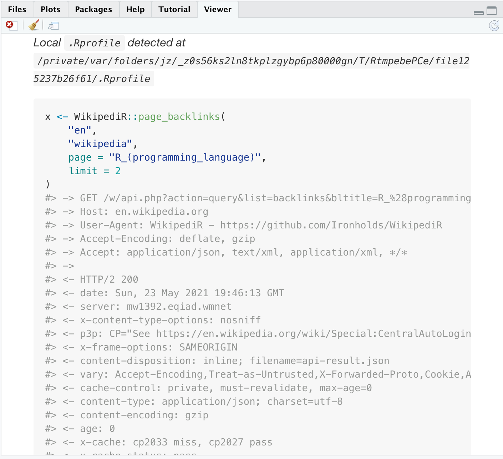
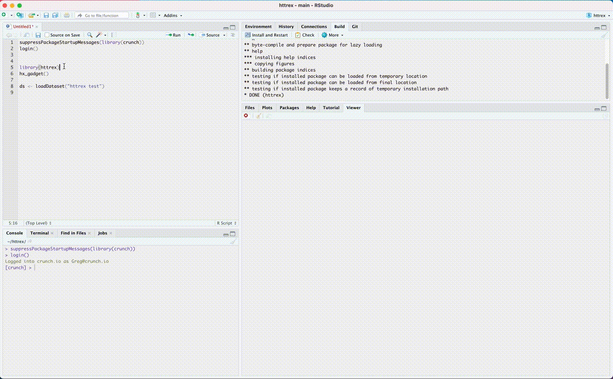

# httrex 

<!-- badges: start -->

[](https://www.tidyverse.org/lifecycle/#experimental)
[](https://CRAN.R-project.org/package=httrex)
<!-- badges: end -->

The httrex package aims to help developers and users of R API clients 
understand the http API requests that their R code is making and be able
to better communicate with the API owners (who may or may not user R)
how they are interacting with the API.

httrex is still an exploration of how to solve this problem and has two 
approaches currently supported.

1) A `reprex`-like interface that takes existing code, reruns it
and creates a document that combines the R code and results with
the API calls and responses interspersed.

2) An experimental shiny gadget that tracks the code in the current R session
and the API calls and responses.


See my talk at useR!2021 during the first elevator pitch sessions, or the [slides](useR2021/httrex_slides_gh.pdf) for my talk.


## Installation

httrex is not (yet) on CRAN, install using the `remotes` package.

``` r
remotes::install_github("gergness/httrex")
```

## Example

### reprex-like interface
The `covid19us` package wraps the COVID Tracking Project API
<https://covidtracking.com/api/>, and is a nice way to test run `httrex`
because it does not require any authentication.

``` r
httrex::httrex({
    x <- WikipediR::page_backlinks(
        "en", 
        "wikipedia", 
        page = "R_(programming_language)", 
        limit = 2
    )
    x$query
})

#> Rendering reprex...
#> Rendered reprex is on the clipboard.
```

Which displays the following in your Viewer (if using RStudio) and
puts the content on your clipboard (if available).  
<a href="man/figures/ex1.md">Markdown Code</a>

<a href="man/figures/ex1.md"></a>

Code is retrieved from the clipboard, current selection or arguments provide
in the same way that they are in the reprex package.


### Shiny gadget
The code to start the shiny gadget is: `httrex::hx_gadget()`. Then run
code as normal.



