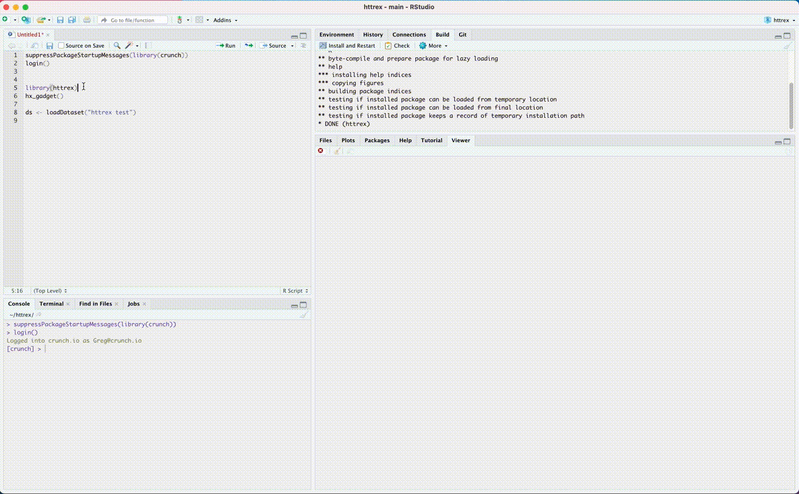
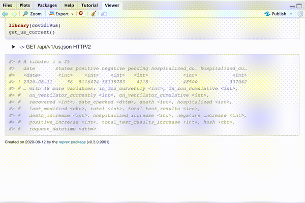
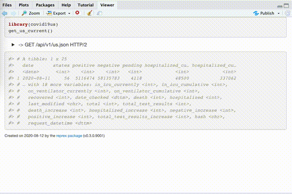

# httrex

<!-- badges: start -->

[](https://www.tidyverse.org/lifecycle/#experimental)
[](https://CRAN.R-project.org/package=httrex)
<!-- badges: end -->

The httrex package aims to help developers and users of R API clients 
understand the http API requests that their R code is making and be able
to better communicate with the API owners (who may or may not user R)
how they are interacting with the API.

httrex is still an exploration of how to solve this problem and has two 
approaches currently supported.

1) A shiny gadget that tracks the code in the current R session
and the API calls and responses.

2) An `httrex`-like interface that takes existing code, reruns it
and creates a document that combines the R code and results with
the API calls and responses interspersed.

## Installation

httrex is not (yet) on CRAN, install using the `remotes` package.

``` r
remotes::install_github("gergness/httrex")
```

## Example

### Shiny gadget
The code to start the shiny gadget is: `httrex::hx_gadget()`. Then run
code as normal.



### reprex-like interface
The `covid19us` package wraps the COVID Tracking Project API
<https://covidtracking.com/api/>, and is a nice way to test run `httrex`
because it does not require any authentication.

``` r
httrex::httrex({
    library(covid19us)
    get_us_current()
})

#> Rendering reprex...
#> Rendered reprex is on the clipboard.
```

Which displays the following in your Viewer (if using RStudio) and
puts the content on your clipboard (if available).  
<a href="man/figures/ex1.md">Markdown Code</a>

<a href="man/figures/ex1.md"></a>


You can also get the data received by the http requests by using the
option `data_in = TRUE`.

``` r
httrex::httrex({
    library(covid19us)
    get_us_current()
}, display = "details", data_in = TRUE)

#> Rendering reprex...
#> Rendered reprex is on the clipboard.
```

Which displays the following in your Viewer (if using RStudio) and
puts the content on your clipboard (if available).  
<a href="man/figures/ex2.md">Markdown Code</a>

<a href="man/figures/ex2.md"></a>


Like the `reprex` package, `httrex` will try to read off your clipboard
if you leave the `x` and `input` arguments empty.
